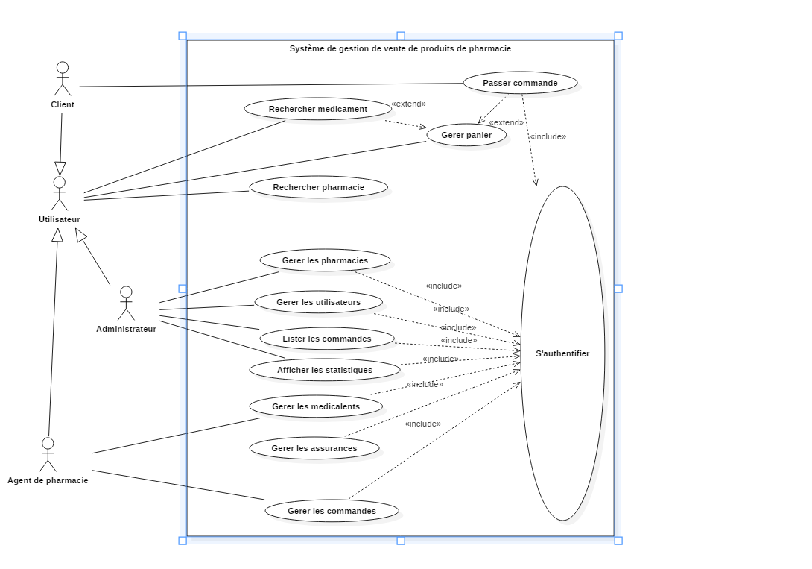
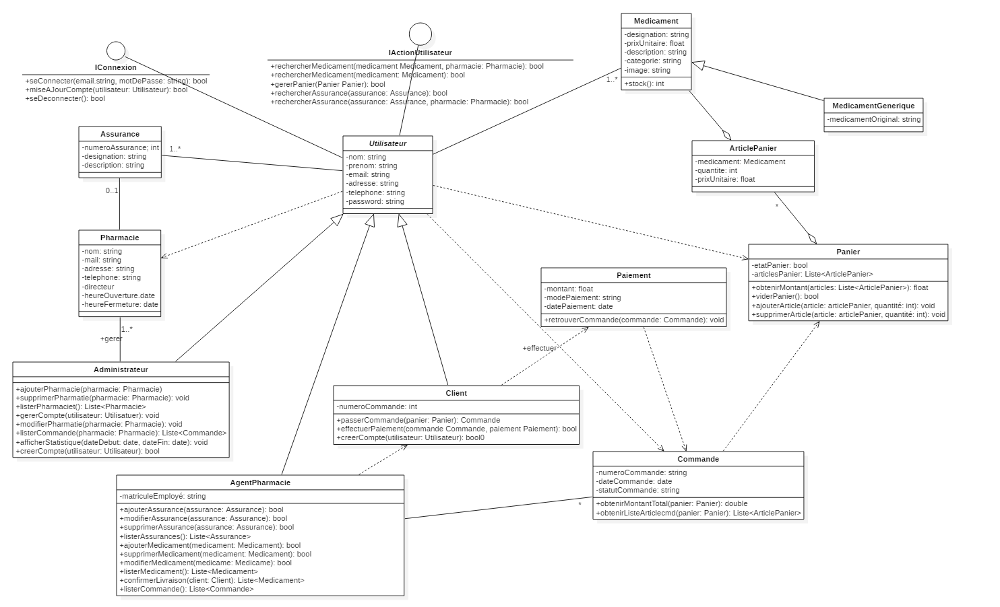

# 💊 SystPharma - Plateforme de gestion de pharmacie

**SystPharma** est une application Java qui permet de gérer les activités d’une pharmacie moderne.  
Ce projet a été conçu dans le cadre du TP (avec la mise à jour progressive) du parcours de formation pour pratiquer la manipulation des collections Java.

## 👥 Acteurs

Client, Agent de pharmacie et Administrateur

## 🧾 Objectifs

Dans sa version 1, le logiciel permet :

### Aux utilisateurs de :

- S’authentifier
- Mettre à jour son compte
- Rechercher un médicament (Afficher les génériques d’un médicament avec les prix associés peut être une scénario d’exception pour rechercher produits)
- Rechercher un médicament dans une pharmacie donnée
- Rechercher une assurance
- Rechercher une assurance prise en charge par une pharmacie
- Gérer un panier. A partir du panier, l’utilisateur peut obtenir le montant total, ajouter un article, supprimer un article ou tous les articles du panier

### Spécifiquement aux clients de :

-Créer compte

- Passer une commande de médicament dans une pharmacie
- Effectuer le paiement de sa commande. A travers sa commande il peut obtenir la liste de ses articles, ainsi que le montant total

### Spécifiquement à l’agent pharmacie de :

Gérer les médicaments :

- Ajouter, supprimer, modifier un médicament en stock
- Lister les médicaments

Gérer les assurances :

- Ajouter, supprimer, modifier une assurance en stock
- Lister les assurances

Gérer les commandes

- Lister les commandes
- Confirmer la livraison d’une commande après livraison ou après paiement et livraison

### Spécifiquement à l’administrateur de :

Gérer les pharmacies :

- Ajouter, supprimer, modifier, lister, gérer les pharmacies.
- Créer compte d’un agent de pharmacie

Gérer les utilisateurs :

- Ajouter, supprimer, modifier, lister, gérer les comptes utilisateur.
- Lister les commandes dans une pharmacie
- Afficher les statistiques sur une période donnée

## Les classes canditates

- Un médicament est caractérisé par : Une désignation, Un prix unitaire, Une description, Une catégorie, Une image
- Un générique est caractérisé par : Une désignation,Un prix unitaire, Une description, Une catégorie, Une image, Un nom de médicament Original
- Une assurance est caractérisée par : Un numéro d’assurance unique, Une désignation, Une description
- Un client est caractérisé par : Un nom, Un prénom, Une adresse email, Une adresse, Mot de passe, Un numéro de téléphone, Un numéro de commande reçu par mail après paiement
- Un agent de pharmacie est caractérisé par : Un matricule d’employé, Un nom, Un prénom, Une adresse email, Une adresse, Mot de passe, Un numéro de téléphone
- Un administrateur est caractérisé par : Un nom, Un prénom, Une adresse email, Une adresse, Mot de passe, Un numéro de téléphone
- Une pharmacie est caractérisée par : Une désignation, Une adresse email, Une adresse, Un numéro de téléphone, Un directeur, Une heure d’ouverture, Une heure de fermeture
- Un Article Panier par : Un médicament, Une quantité, Un prix unitaire
- Un Panier par : Un état panier, Une liste des articles panier
- Un paiement par : Un montant, Un mode paiement, Une date de paiement
- Une commande est caractérisée par : Un numéro de la commande, Une date de commande, Un statut commande

### Use Case diagram

### Class Diagram

## 📁 Structure du projet

TP5-ProjetPersoJavaClass/ ├── src/ # Code source ├── .idea/ # Fichiers de configuration IntelliJ ├── .gitignore # Fichiers à ignorer ├── out/ # Dossier de compilation ├── untitled.iml # Fichier de configuration projet IntelliJ └── README.md # Présentation du projet

## 🚀 Technologies utilisées

- Java
- Collections (List, Set, Map)
- IntelliJ IDEA
- Git & GitHub

## 🛠️ En cours

- [x] Création des classes de base
- [ ] Connexion entre entités
- [x] Interface utilisateur
- [ ] Ajout de la persistance des données

## 📚 Auteur

- Sidonie — Apprenante Fullstack Java, Objis (Février 2024–2025)
- Linkedin: www.linkedin.com/in/sidonie-djuissi-fohouo
- Email: sidoniedjuissifohouo@gmail.com
- Tel: +237 696 00 23 77
- Dernière mise à jour 02/05/2025
